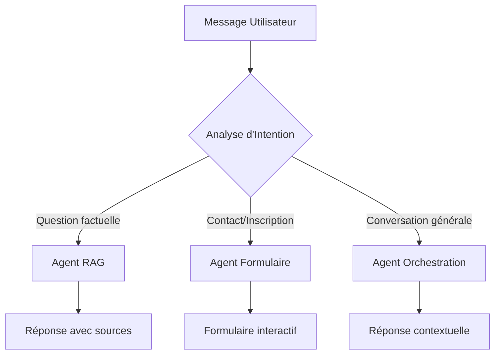

# ESILV Smart Assistant - Documentation Technique

## 📋 Table des Matières

1. [Architecture Globale](#architecture)
2. [Structure du Projet](#structure)
3. [API Endpoints](#api)
4. [Base de Données](#database)
5. [Système Multi-Agents](#agents)
6. [Authentification](#auth)
7. [Performance et Caching](#performance)
8. [Tests](#tests)
9. [Déploiement](#deployment)

---

## <a name="architecture">🏗️ Architecture Globale</a>

### Vue d'Ensemble
```
┌─────────────────────────────────────────────────────────────────┐
│                    Frontend (Next.js 15)                │
├─────────────────────────────────────────────────────────────────┤
│  ┌─────────────┐  ┌─────────────┐  ┌─────────────┐ │
│  │   Chat     │  │   Admin     │  │ Documents   │ │
│  │  Interface │  │ Dashboard   │  │ Management  │ │
│  └─────────────┘  └─────────────┘  └─────────────┘ │
├─────────────────────────────────────────────────────────────────┤
│                    Backend (API Routes)                │
├─────────────────────────────────────────────────────────────────┤
│  ┌─────────────┐  ┌─────────────┐  ┌─────────────┐ │
│  │     Chat    │  │   Admin     │  │ Documents   │ │
│  │     API     │  │     API     │  │     API     │ │
│  └─────────────┘  └─────────────┘  └─────────────┘ │
├─────────────────────────────────────────────────────────────────┤
│                   Data Layer                           │
├─────────────────────────────────────────────────────────────────┤
│  ┌─────────────┐  ┌─────────────┐  ┌─────────────┐ │
│  │   SQLite    │  │  Prisma     │  │    AI       │ │
│  │  Database   │  │    ORM      │  │ Integration  │ │
│  └─────────────┘  └─────────────┘  └─────────────┘ │
└─────────────────────────────────────────────────────────────────┘
```

### Technologies Clés
- **Frontend**: Next.js 15, TypeScript, Tailwind CSS, Framer Motion
- **Backend**: Next.js API Routes, Prisma ORM
- **Database**: SQLite avec schéma relationnel complet
- **AI**: z-ai-web-dev-sdk pour LLM et web search
- **State Management**: TanStack Query, Zustand
- **UI Components**: shadcn/ui avec Lucide Icons

---

## <a name="structure">📁 Structure du Projet</a>

```
src/
├── app/                          # App Router structure
│   ├── page.tsx                  # Main chatbot interface
│   ├── admin/page.tsx             # Admin dashboard
│   ├── documents/page.tsx          # Document management
│   ├── auth/signin/page.tsx        # Authentication
│   └── api/                     # API routes
│       ├── chat/route.ts          # Main chat API
│       ├── form-submit/route.ts    # Form submissions
│       ├── knowledge/route.ts      # Knowledge base
│       ├── feedback/route.ts       # Feedback system
│       ├── errors/route.ts         # Error reporting
│       └── admin/                # Admin APIs
├── components/                    # Reusable components
│   ├── ui/                      # shadcn/ui components
│   ├── AuthProvider.tsx          # NextAuth provider
│   ├── QueryProvider.tsx         # TanStack Query provider
│   ├── ErrorBoundary.tsx         # Error handling
│   └── Navigation.tsx           # Navigation component
├── hooks/                        # Custom hooks
│   ├── use-api.ts               # API hooks with caching
│   ├── use-error-handling.ts    # Error handling hooks
│   ├── use-mobile.ts            # Mobile detection
│   └── use-toast.ts             # Toast notifications
├── lib/                          # Utilities
│   ├── db.ts                   # Prisma client
│   ├── auth.ts                  # NextAuth config
│   └── utils.ts                # Helper functions
└── __tests__/                     # Test files
    ├── chatbot.test.tsx         # Chat interface tests
    ├── admin.test.tsx           # Admin dashboard tests
    └── hooks.test.tsx           # Hook tests
```

---

## <a name="api">🔌 API Endpoints</a>

### Chat System
#### `POST /api/chat`
**Description**: Point d'entrée principal pour le chatbot avec orchestration multi-agents

**Request Body**:
```typescript
{
  message: string,
  conversationHistory?: Array<{
    role: 'user' | 'assistant',
    content: string
  }>
}
```

**Response**:
```typescript
{
  response: string,
  agentType: 'retrieval' | 'form_filling' | 'orchestration',
  showForm?: boolean
}
```

### Form Submissions
#### `POST /api/form-submit`
**Description**: Gestion des soumissions de formulaire

**Request Body**:
```typescript
{
  name?: string,
  email?: string,
  phone?: string,
  program?: string,
  year?: string,
  message?: string
}
```

### Feedback System
#### `POST /api/feedback`
**Description**: Enregistrement du feedback utilisateur

**Request Body**:
```typescript
{
  messageId: string,
  feedback: 'up' | 'down',
  comment?: string
}
```

#### `GET /api/feedback`
**Response**:
```typescript
{
  satisfactionRate: number,
  totalFeedback: number,
  positiveFeedback: number,
  negativeFeedback: number,
  stats: Array<{
    agentType: string,
    feedback: string,
    _count: { feedback: number }
  }>
}
```

### Admin APIs
- `GET /api/admin/stats` - Statistiques globales
- `GET /api/admin/conversations` - Conversations récentes
- `GET /api/admin/agent-stats` - Statistiques d'utilisation des agents

### Document Management
- `POST /api/documents/upload` - Upload de fichiers
- `POST /api/documents/upload-url` - Import depuis URL
- `GET /api/documents/upload` - Liste des documents

---

## <a name="database">🗄️ Base de Données</a>

### Schéma Prisma

```prisma
model User {
  id        String   @id @default(cuid())
  email     String   @unique
  name      String?
  phone     String?
  program   String?
  year      String?
  createdAt DateTime @default(now())
  updatedAt DateTime @updatedAt
  
  conversations Conversation[]
  formSubmissions FormSubmission[]
}

model Conversation {
  id        String   @id @default(cuid())
  userId    String?
  sessionId String?
  createdAt DateTime @default(now())
  updatedAt DateTime @updatedAt
  
  user      User?    @relation(fields: [userId], references: [id])
  messages  Message[]
}

model Message {
  id             String   @id @default(cuid())
  conversationId String
  role           String   // 'user' or 'assistant'
  content        String
  agentType      String?  // 'retrieval', 'form_filling', 'orchestration'
  timestamp      DateTime @default(now())
  feedback       String?  // 'up', 'down', null
  feedbackComment String?  // Optional comment for feedback
  
  conversation   Conversation @relation(fields: [conversationId], references: [id])
}

model FormSubmission {
  id        String   @id @default(cuid())
  userId    String?
  type      String   // 'contact', 'registration', 'inquiry'
  data      String   // JSON string
  status    String   @default("pending") // 'pending', 'processed', 'completed'
  createdAt DateTime @default(now())
  updatedAt DateTime @updatedAt
  
  user      User?    @relation(fields: [userId], references: [id])
}

model Document {
  id          String   @id @default(cuid())
  title       String
  content     String
  source      String   // URL or file path
  type        String   // 'website', 'pdf', 'doc', etc.
  embedding   String?  // Vector embedding as string
  metadata    String?  // JSON metadata
  createdAt   DateTime @default(now())
  updatedAt   DateTime @updatedAt
}

model KnowledgeBase {
  id          String   @id @default(cuid())
  question    String
  answer      String
  category    String   // 'programs', 'admissions', 'courses', etc.
  confidence  Float?
  createdAt   DateTime @default(now())
  updatedAt   DateTime @updatedAt
}
```

---

## <a name="agents">🤖 Système Multi-Agents</a>

### Architecture des Agents

#### 1. Agent d'Orchestration
**Rôle**: Coordinateur principal
- Analyse le message utilisateur
- Détermine l'agent approprié
- Gère les transitions entre agents
- Fournit des réponses générales

#### 2. Agent de Récupération (RAG)
**Rôle**: Réponses factuelles
- Recherche dans la base de connaissances locale
- Intégration avec web search ESILV
- Génération de réponses contextuelles
- Score de confiance

#### 3. Agent de Formulaire
**Rôle**: Collecte de données
- Détection d'intention de contact
- Guidage utilisateur
- Validation des informations
- Enregistrement en base

### Flux de Décision



---

## <a name="auth">🔐 Authentification</a>

### Configuration NextAuth.js

```typescript
export const authOptions: NextAuthOptions = {
  providers: [
    CredentialsProvider({
      name: 'credentials',
      credentials: {
        email: { label: 'Email', type: 'email' },
        password: { label: 'Password', type: 'password' }
      },
      async authorize(credentials) {
        // Logique d'authentification
        // Création automatique d'utilisateur pour démo
      }
    })
  ],
  session: { strategy: 'jwt' },
  callbacks: {
    async jwt({ token, user }) {
      if (user) token.id = user.id
      return token
    },
    async session({ session, token }) {
      if (token) session.user.id = token.id
      return session
    }
  }
}
```

### Types d'Utilisateurs
- **Utilisateur Standard**: Accès au chatbot
- **Administrateur**: Accès dashboard + analytics
- **Démo**: Email `admin@esilv.fr` pour démo

---

## <a name="performance">⚡ Performance et Caching</a>

### TanStack Query Configuration

```typescript
new QueryClient({
  defaultOptions: {
    queries: {
      staleTime: 1000 * 60 * 5,    // 5 minutes
      cacheTime: 1000 * 60 * 10,   // 10 minutes
      retry: 3,
      retryDelay: attemptIndex => Math.min(1000 * 2 ** attemptIndex, 30000),
      refetchOnWindowFocus: false
    },
    mutations: {
      retry: 1
    }
  }
})
```

### Cache Keys Strategy

```typescript
export const CACHE_KEYS = {
  conversations: ['conversations'],
  stats: ['stats'],
  feedback: ['feedback'],
  documents: ['documents'],
  knowledgeBase: ['knowledgeBase'],
  agentStats: ['agentStats'],
} as const
```

### Optimisations
- **Lazy Loading**: Composants chargés à la demande
- **Code Splitting**: Division automatique du bundle
- **Image Optimization**: Next.js Image component
- **Database Indexing**: Index sur champs fréquemment queryés
- **API Response Caching**: Mise en cache des réponses communes

---

## <a name="tests">🧪 Tests</a>

### Structure des Tests

#### Tests de Composants
- **Chatbot Interface**: `__tests__/chatbot.test.tsx`
- **Admin Dashboard**: `__tests__/admin.test.tsx`
- **API Hooks**: `__tests__/hooks.test.tsx`

#### Coverage
- **Rendering**: Test du rendu des composants
- **Interactions**: Simulation des actions utilisateur
- **API Integration**: Mock des réponses API
- **Error Handling**: Validation des cas d'erreur

#### Commandes de Test

```bash
# Exécuter tous les tests
npm test

# Tests avec coverage
npm run test:coverage

# Tests en mode watch
npm run test:watch
```

### Mock Strategy

```typescript
// Mock NextAuth
jest.mock('next-auth/react', () => ({
  useSession: jest.fn(() => ({
    data: { user: { id: '1', email: 'test@example.com' } },
    status: 'authenticated'
  }))
}))

// Mock fetch global
global.fetch = jest.fn()
```

---

## <a name="deployment">🚀 Déploiement</a>

### Configuration Production

#### Environment Variables
```env
DATABASE_URL="file:./dev.db"
NEXTAUTH_URL="http://localhost:3000"
NEXTAUTH_SECRET="your-secret-key"
AI_PROVIDER="ollama"
OLLAMA_BASE_URL="http://localhost:11434"
OLLAMA_MODEL="llama3:latest"
```

#### Build Process
```bash
# Build optimisé
npm run build

# Démarrage production
npm run start
```

### Docker Support
```dockerfile
FROM node:18-alpine
WORKDIR /app
COPY package*.json ./
RUN npm ci --only=production
COPY . .
RUN npm run build
EXPOSE 3000
CMD ["npm", "start"]
```

### Monitoring
- **Error Tracking**: API `/api/errors`
- **Performance**: TanStack Query devtools
- **Analytics**: Dashboard avec métriques temps réel
- **Health Checks**: Endpoint de santé système

---

## 🎯 Bonnes Pratiques

### Code Quality
- **TypeScript Strict**: Typage complet
- **ESLint**: Règles de qualité
- **Prettier**: Formatage automatique
- **Husky**: Pre-commit hooks

### Security
- **Input Validation**: Zod schemas
- **SQL Injection**: Prisma ORM protection
- **XSS Protection**: React auto-escaping
- **Rate Limiting**: API protection

### Accessibility
- **ARIA Labels**: Screen reader support
- **Keyboard Navigation**: Full keyboard access
- **Color Contrast**: WCAG compliance
- **Focus Management**: Logical tab order

---

## 📚 Ressources Externes

### Documentation
- [Next.js Documentation](https://nextjs.org/docs)
- [Prisma Docs](https://www.prisma.io/docs)
- [shadcn/ui](https://ui.shadcn.com)
- [Framer Motion](https://www.framer.com/motion)

### Outils
- **Database Studio**: Prisma Studio
- **API Testing**: Postman/Insomnia
- **Performance**: Lighthouse, Web Vitals
- **Monitoring**: Browser DevTools

---

*Document généré le ${new Date().toLocaleDateString('fr-FR')}*